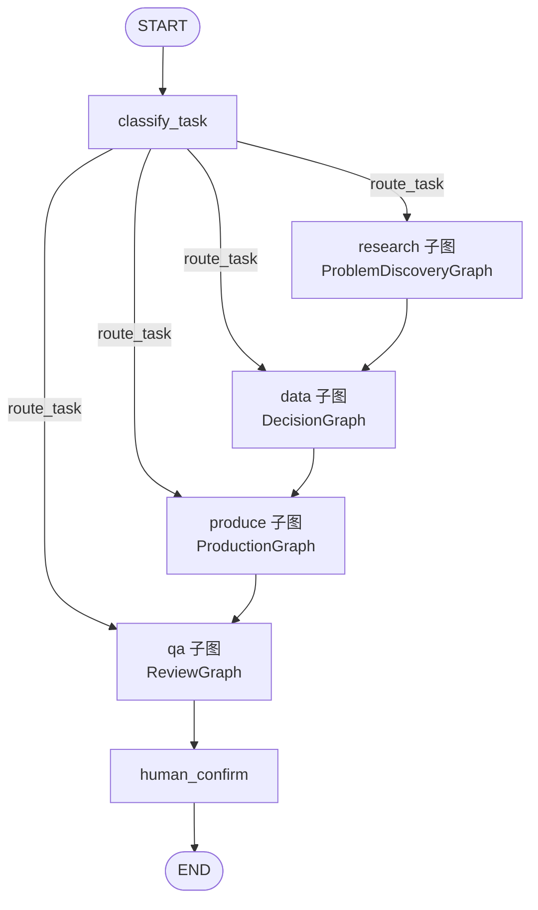
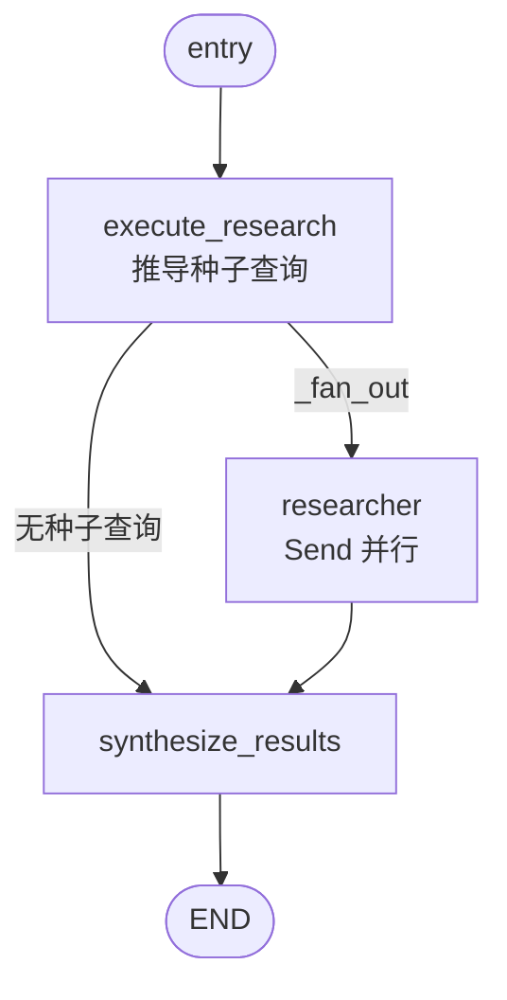
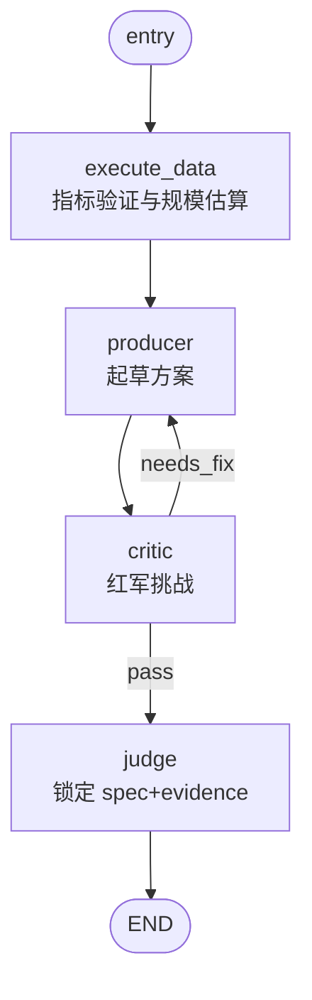
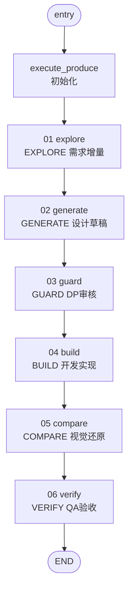
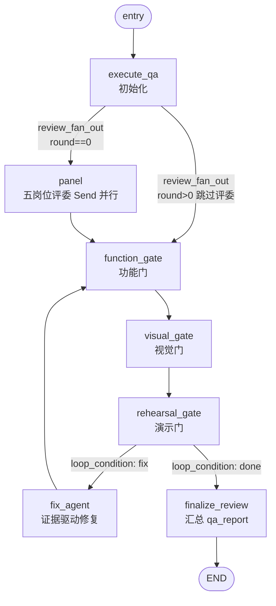

# CodePilot

多 Agent 动态工作流系统 —— 基于 LangGraph + LangChain 构建的可审计、可恢复、可复用的智能体生产系统。

## 目录结构

```
CodePilot/
├── README.md                                    # 本文件
├── 多Agent动态工作流系统技术方案.md              # 系统技术方案文档
└── backend/                                     # 后端服务
    ├── pyproject.toml                           # Python 项目配置与依赖
    ├── Makefile                                 # 快捷命令
    ├── .env.example                             # 环境变量模板
    ├── .gitignore
    ├── .python-version                          # Python 版本锁定
    ├── langgraph.json                           # LangGraph Platform 图注册配置
    ├── src/codepilot/                           # 主包
    │   ├── __init__.py
    │   ├── py.typed
    │   ├── core/                                # 核心配置与模型
    │   │   ├── config.py                        # Settings (Pydantic)
    │   │   ├── create_model.py                  # ChatModel 工厂
    │   │   ├── agent_loader.py                  # Agent Harness 加载与调用
    │   │   └── memory_store.py                  # 记忆存储读写
    │   ├── states/                              # 状态定义
    │   │   └── workflow_state.py                # 全局 State Bus (TypedDict)
    │   ├── nodes/                               # 节点函数（按子图分组）
    │   │   ├── classify_task.py                 # 任务分类
    │   │   ├── route_task.py                    # 动态路由
    │   │   ├── execute_research.py              # 问题发现：推导种子查询
    │   │   ├── researcher.py                    # 问题发现：单路并行研究
    │   │   ├── synthesize_results.py            # 问题发现：结果合成
    │   │   ├── execute_data.py                  # 决策：指标验证与规模估算
    │   │   ├── producer.py                      # 决策：起草方案
    │   │   ├── critic.py                        # 决策：红军挑战
    │   │   ├── judge.py                         # 决策：锁定 spec/evidence
    │   │   ├── execute_produce.py               # 生产：初始化
    │   │   ├── production_steps.py              # 生产：静态六步(explore~verify)
    │   │   ├── execute_qa.py                    # 评审：初始化
    │   │   ├── review_steps.py                  # 评审：五岗位评委+三道门禁+修复回环
    │   │   ├── execute_review.py                # （预留，暂未接入图）
    │   │   └── human_confirm.py                 # 人工确认
    │   ├── graphs/                              # 图定义
    │   │   ├── main_workflow.py                 # 主工作流（顶层编排器）
    │   │   ├── problem_discovery.py             # 问题发现子图（fan-out/synthesis）
    │   │   ├── decision.py                      # 决策子图（对抗式验证循环）
    │   │   ├── production.py                    # 生产子图（静态六步子流程）
    │   │   └── review.py                        # 评审子图（红蓝对抗+三道门禁）
    │   └── tools/                               # 工具定义
    │       ├── search_km.py                     # KM 检索
    │       ├── query_sql.py                     # SQL 取数
    │       ├── screenshot_diff.py               # 视觉比对
    │       ├── deploy_demo.py                   # Demo 部署
    │       └── vector_memory.py                 # 向量记忆
    ├── agents/                                  # Agent Harness
    │   ├── research.yaml
    │   ├── data.yaml
    │   ├── design.yaml
    │   ├── qa.yaml
    │   └── review_panels/                       # 五位评审视角
    │       ├── platform.yaml
    │       ├── assets.yaml
    │       ├── user_poi.yaml
    │       ├── merchant.yaml
    │       └── city_supply.yaml
    ├── memory/                                  # 记忆存储
    │   ├── project_memory.json                  # 项目级记忆
    │   └── agent_memory/                        # Agent 分域记忆
    ├── checkpoints/                             # Checkpoint 持久化
    └── scripts/                                 # 脚本工具
        └── setup.py
```

## 核心设计

- **编排引擎**：LangGraph `StateGraph` + 子图 + Checkpoint
- **Agent 框架**：LangChain `Runnable` + `bind_tools`
- **状态总线**：共享 `WorkflowState`（TypedDict），替代动态传参
- **质量门禁**：功能门、视觉门、演示门
- **资产沉淀**：知识记忆、生产资产、评审资产

## 图结构

CodePilot 采用「主工作流 + 4 个子图」的分层编排方式：`main_workflow` 负责阶段调度，
每个阶段各自委托给一个已编译的子图（`ProblemDiscoveryGraph` / `DecisionGraph` /
`ProductionGraph` / `ReviewGraph`），子图与主图共享同一份 `WorkflowState` schema。

### 主工作流（`graphs/main_workflow.py`）



- **`classify_task`**：用 LLM（失败时降级为规则）判断本次运行应从 `research /
  data / produce / qa` 四个阶段中的哪一个**进入**；`route_task` 依据
  `next_step` 做条件路由。
- 四个阶段本身**严格顺序执行**（`research -> data -> produce -> qa`），
  `classify_task` 只决定入口，不跳过后续阶段。
- 每个子图通过 `_invoke_subgraph_as_node` 包装后作为父图的普通节点调用，
  该包装器只回传子图产生的**增量**（尤其是 `facts_ledger` /
  `issues_ledger` / `checkpoints` 等使用 `operator.add` reducer 的列表字段），
  避免父子图共享 schema 时状态被重复累加。
- 末尾统一进入 `human_confirm` 节点等待人工确认后结束。

### 1. 问题发现子图（`graphs/problem_discovery.py`）—— fan-out/synthesis



- `execute_research` 产出 `research_queries`（种子查询列表）。
- `_fan_out` 用 `langgraph.types.Send` 为每条种子查询并行派发一个
  `researcher` 任务；若没有种子查询则直接跳到 `synthesize`（避免空 Send
  列表导致提前终止）。
- `synthesize_results` 汇总各路 `researcher` 的发现，写入 `facts_ledger`。

### 2. 决策子图（`graphs/decision.py`）—— 对抗式验证循环



- `producer -> critic` 构成对抗式循环：`critic` 扮演"红军"主动挑刺，
  经 `_needs_fix` 路由决定是回到 `producer` 修改还是进入 `judge`。
- 循环保护：`decision_round` 达到 `critic._MAX_ROUNDS`（3 轮）后强制
  `pass`，保证一定收敛。
- `judge` 最终锁定 `spec` / `evidence`，这两个字段归本子图所有。

### 3. 生产子图（`graphs/production.py`）—— 静态六步子流程



- 唯一一个**不可缺步的静态串联子流程**：六步严格顺序执行，无分支、
  无循环，每步落一个 Checkpoint 证明真实完成。
- 最终在 `verify` 汇总产出 `demo_artifact`，归本子图所有。

### 4. 评审子图（`graphs/review.py`）—— 红蓝对抗 + 三道门禁



- **五岗位评委并行评审**：`review_fan_out` 用 `Send` 并行派发到
  `platform / assets / user_poi / merchant / city_supply` 五个评审视角
  （`agents/review_panels/*.yaml`）；若已进入修复回环（`review_round > 0`）
  则跳过评委，直接重跑三道门禁。
- **三道门禁严格串联**：`function_gate`（关键路径/状态一致性/控制台报错）
  -> `visual_gate`（`screenshot_diff` 截图比对）-> `rehearsal_gate`（完整
  彩排与兜底方案）。
- **修复回环**：`loop_condition` 依据 `issues_ledger` 中是否存在未解决的
  高风险（`risk == "high"`）问题决定 `fix`（回到 `fix_agent` 修复后重新
  跑三道门禁）还是 `done`（进入 `finalize_review`）。循环保护：
  `review_round` 达到 `_MAX_FIX_ROUNDS`（3 轮）后强制 `done`。
- `finalize_review` 汇总三道门禁结果为 `qa_report`，并将已处理问题标记
  为 `resolved`。

### 共享状态总线（`states/workflow_state.py`）

所有图与节点通过同一个 `WorkflowState`（`TypedDict`）通信，无需在函数间显式传参：

| 分类 | 字段 | 归属 / 说明 |
| --- | --- | --- |
| 目标与约束 | `goal` / `scope` / `constraints` / `exit_conditions` | 全局输入 |
| 三大台账 | `facts_ledger` / `rules_ledger` / `issues_ledger` | 使用 `operator.add` 累加 reducer |
| 阶段产物 | `spec` / `evidence` / `demo_artifact` / `qa_report` | 分别归 decision / production / review 子图所有 |
| 控制信号 | `checkpoints` / `next_step` / `human_confirm` | 路由与审计 |
| 问题发现工作字段 | `research_queries` / `research_findings` | fan-out 种子查询与发现 |
| 决策工作字段 | `decision_proposal` / `decision_critique` / `decision_verdict` / `decision_round` | producer/critic 对抗循环 |
| 生产工作字段 | `production_step` / `design_draft` / `design_audit` / `build_artifact` / `visual_compare` | 静态六步子流程 |
| 评审工作字段 | `review_panel_results` / `review_issues` / `review_round` / `function_gate` / `visual_gate` / `rehearsal_gate` | 红蓝对抗与三道门禁 |

## 快速开始

```bash
cd backend
cp .env.example .env
# 编辑 .env 填入 API Keys

# 安装依赖（含 langgraph-cli）
make install

# 启动 LangGraph Platform 本地开发服务器（自带 Studio UI + API）
make run
# 等价于：langgraph dev
```

`langgraph dev` 会读取 `langgraph.json` 中注册的 `main_workflow` 图，启动本地调试服务器（默认 `http://127.0.0.1:2024`），并自动打开 LangGraph Studio 可视化调试界面，无需手写 FastAPI 服务即可通过 `/threads`、`/runs/stream` 等原生 API 调用工作流。

## 文档

- [多Agent动态工作流系统技术方案.md](./多Agent动态工作流系统技术方案.md)
